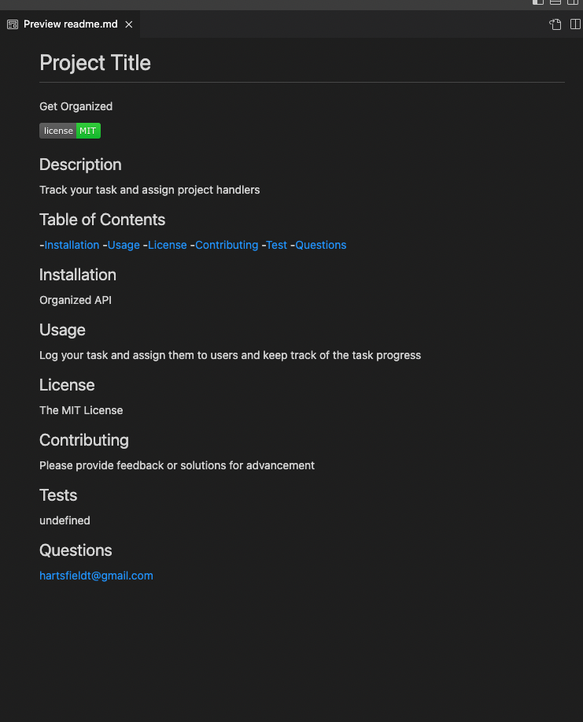

# Professional README.md Generator

## Purpose

To generated a professional README.md file for a new project.

## Requirements

The user must be presented with a CLI application that accepts the users input:

- Prompt the user with a series of questions to compile the professional README.md file.
- The README.md file must contain; The title of my project and sections entitled: description, table of contents, installation, usage, license, contributing, tests and questions.
- The users input for project name must be displayed as the title of the project. The subsequent questions prompt the users remaining sections.
- The user must be able to select from several open source library licenses and then a badge must render to the README.md file with the users selection.
- Link the users github and email address to render in the questions section.
- Link the table of contents to direct the user to the respective section of the documentation.

## Screencastify

https://youtu.be/6AJlZ-_djug

## Website

https://hartsfieldt.github.io/generator-template/

## Git Hub

https://github.com/hartsfieldt/generator-template

## Contribution

Made with ❤️ by Teresa Hartsfield
